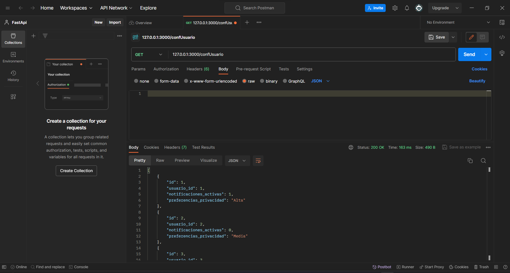

<!-- Documentacion de un endpoint get que trae un un acoleccion de datos de la coleccion de confUsuarios -->

# Endpoint: `GET /confusuario`

Permite obtener todos los datos de la coleccion de confUsuarios.

## Ejemplo de Solicitud

```http
    GET: /confusuario
```

## Respuesta Exitosa (Código 200 OK)

```json
    [
        {
        "id": 1,
        "usuario_id": 1,
        "notificaciones_activas": 1,
        "preferencias_privacidad": "Alta"
        },
        {
            "id": 2,
            "usuario_id": 3,
            "notificaciones_activas": 1,
            "preferencias_privacidad": "Alta"
        },
        {
            "id": 3,
            "usuario_id": 3,
            "notificaciones_activas": 1,
            "preferencias_privacidad": "Baja"
        },
        {
            "id": 5,
            "usuario_id": 3,
            "notificaciones_activas": 0,
            "preferencias_privacidad": "Alta"
        }
    ]

```

## Respuestas de Errores Posibles

- Código 404 Not Found:

  ```json
  {
    "errno": 404,
    "error": "not_found",
    "error_description": "No se encontró el Contacto."
  }
  ```

- Código 500 Internal Server Error:

  ```json
  {
    "errno": 500,
    "error": "internal_error",
    "error_description": "Ocurrió un problema para procesar la solicitud"
  }
  ```

## Imagen de la respuesta en postman



## Notas Adicionales

- Recuerda se debe colocar correctamente la ruta para obtener todos los datos de la coleccion de confUsuarios.
