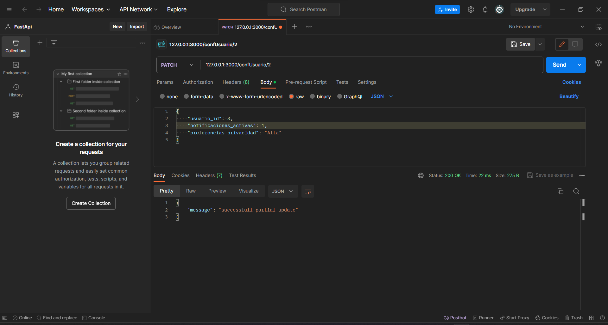

<!-- Documentacion de un endpoint patch que actualiza parcialmente un registro en la coleccion de configuracion del usuario /confusuario{id} -->

# Endpoint: `PATCH /confusuario/{id}`

Permite actualizar parcialmente la información de una configuracion de usuario específica mediante su identificador único.

## Parámetros de URL

- `{id}` (obligatorio): Identificador único de la configuracion de usuario que se desea actualizar.

## Ejemplo de Solicitud

```json

PATCH /confusuario/3
{
    "usuario_id": 1,
    "notificaciones_activas": 1,
    "preferencias_privacidad": "Alta"
}
```

## Respuesta Exitosa (Código 200 OK)

```json
{
    "message": "succesfull partial update"
}
```

## Respuestas de Errores Posibles

- Código 404 Not Found:

  ```json
  {
    "errno": 404,
    "error": "not_found",
    "error_description": "No se encontró la configuracion de usuario."
  }
  ```

- Código 500 Internal Server Error:

  ```json
  {
    "errno": 500,
    "error": "internal_error",
    "error_description": "Ocurrió un problema para procesar la solicitud"
  }
  ```

## Imagen de la respuesta en postman



## Notas Adicionales

- Asegurate de incluir un ID válido en la solicitud para actualizar la información sobre la configuracion de usuario en específico.
- Recuerda que los campos que no se incluyan en la solicitud no serán actualizados.
- Recuerda que el usuario debe ser un usuario existente.

