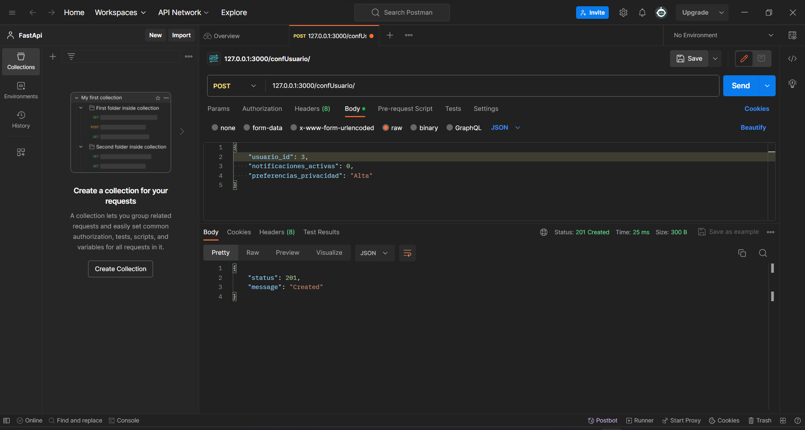

<!-- Documentacion de un endpoint post que añade un nueva configuracion de usuario a la coleccion confusuarios -->

# Endpoint: `POST /confusuario`

Permite añadir una nueva configuracion de usuario a la coleccion de confusuarios.

## Ejemplo de Solicitud

```json
POST /confusuario
{
    "usuario_id": 1,
    "notificaciones_activas": 1,
    "preferencias_privacidad": "Alta"
}
```

## Respuesta Exitosa (Código 201 Created)

```json
{
    status: 201,
    message: "created"
}
```

## Respuestas de Errores Posibles

- Código 400 Bad Request:

  ```json
  {
    "errno": 400,
    "error": "bad_request",
    "error_description": "La solicitud no es válida"
  }
  ```

- Código 500 Internal Server Error:

  ```json
  {
    "errno": 500,
    "error": "internal_error",
    "error_description": "Ocurrió un problema para procesar la solicitud"
  }
  ```

## Imagene de la respuesta en postman



## Notas Adicionales

- Recuerda se debe colocar correctamente la ruta para añadir una nueva configuracion de usuario.
- Recuerda que el usuario debe ser un usuario existente.
