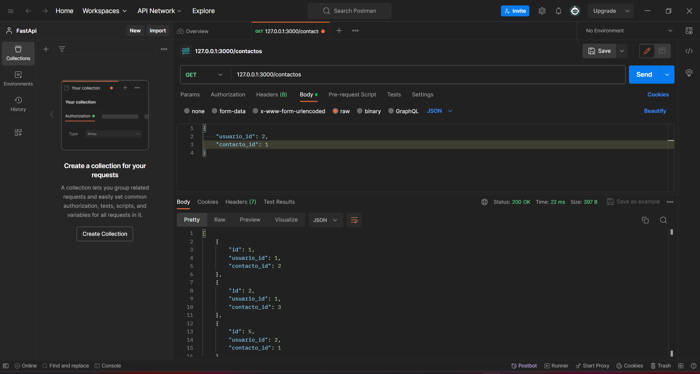

<!-- Documentacion de un endpoint get que trae los items que se encuentran en la coleccion contactos -->

# Endpoint: `GET /contactos`

Permite obtener la lista de contactos que se encuentran en la coleccion de contactos.

## Ejemplo de Solicitud

```http
GET /contactos
```

## Respuesta Exitosa (Código 200 OK)

```json
[
    {
        "id": 1,
        "usuario_id": 1,
        "contacto_id": 2,
    },
    {
        "id": 2,
        "usuario_id": 1,
        "contacto_id": 3,
    },
    {
        "id": 3,
        "usuario_id": 1,
        "contacto_id": 4,
    },
    {
        "id": 4,
        "usuario_id": 1,
        "contacto_id": 5,
    }
]
```

## Respuestas de Errores Posibles

- Código 400 Bad Request:

  ```json
  {
    "errno": 400,
    "error": "bad_request",
    "error_description": "La solicitud no es válida"
  }
  ```

- Código 500 Internal Server Error:

  ```json
  {
    "errno": 500,
    "error": "internal_error",
    "error_description": "Ocurrió un problema para procesar la solicitud"
  }
  ```

## Imagene de la respuesta en postman



## Notas Adicionales

- Recuerda se debe colocar correctamente la ruta para obtener los contactos.
- Recuerda que el usuario debe ser un usuario existente.

