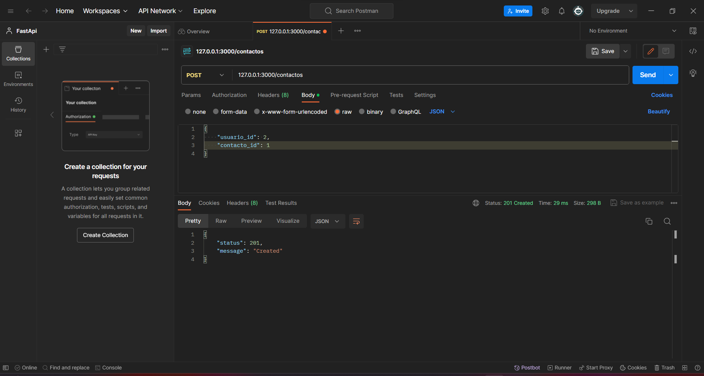

<!-- Documentacion de un endpoint post que añade un nuevo contacto a la coleccion contactos -->

# Endpoint: `POST /contactos`

Permite añadir un nuevo contacto a la coleccion de contactos.

## Ejemplo de Solicitud

```json
POST /contactos
{
    "usuario_id": 1,
    "contacto_id": 2,
    "fecha_creacion": "2023-12-08T00:00:00.000Z"
}
```

## Respuesta Exitosa (Código 201 Created)

```json
{
    status: 201,
    message: "created"
}
```

## Respuestas de Errores Posibles

- Código 400 Bad Request:

  ```json
  {
    "errno": 400,
    "error": "bad_request",
    "error_description": "La solicitud no es válida"
  }
  ```

- Código 500 Internal Server Error:

  ```json
  {
    "errno": 500,
    "error": "internal_error",
    "error_description": "Ocurrió un problema para procesar la solicitud"
  }
  ```

## Imagene de la respuesta en postman



## Notas Adicionales

- Recuerda se debe colocar correctamente la ruta para añadir un nuevo contacto.
- Recuerda que el usuario y el contacto deben ser usuarios existentes.
