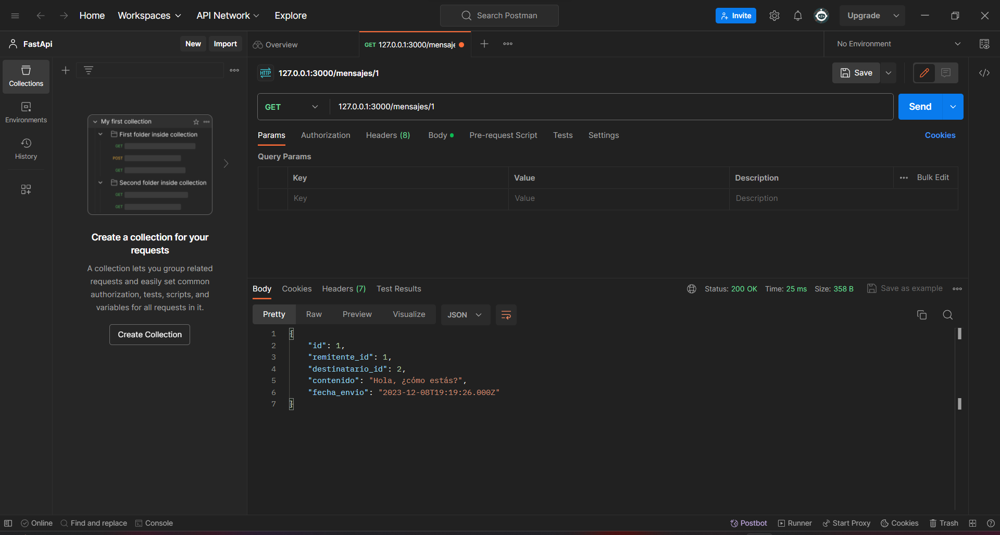

<!-- Documentacion de un endpoint get que trae un item especifico de la coleccion mensajes -->

# Endpoint: `GET /mensajes/{id}`

Permite obtener un mensaje específico mediante su identificador único.

## Parámetros de URL

- `{id}` (obligatorio): Identificador único del mensaje que se desea obtener.

## Ejemplo de Solicitud

```json

GET /mensajes/1

```

## Respuesta Exitosa (Código 200 OK)

```json

{
    "id": 1,
    "remitente_id": 1,
    "destinatario_id": 2,
    "contenido": "Hola, ¿cómo estás?",
    "fecha_envio": "2023-12-08T19:19:26.000Z"
}

```

## Respuestas de Errores Posibles

- Código 404 Not Found:

  ```json
  {
    "errno": 404,
    "error": "not_found",
    "error_description": "No se encontró el Mensaje."
  }
  ```

- Código 500 Internal Server Error:

  ```json
  {
    "errno": 500,
    "error": "internal_error",
    "error_description": "Ocurrió un problema para procesar la solicitud"
  }
  ```

## Imagene de la respuesta en postman



## Notas Adicionales

- Asegurate de incluir un ID válido en la solicitud para obtener el mensaje en específico.
