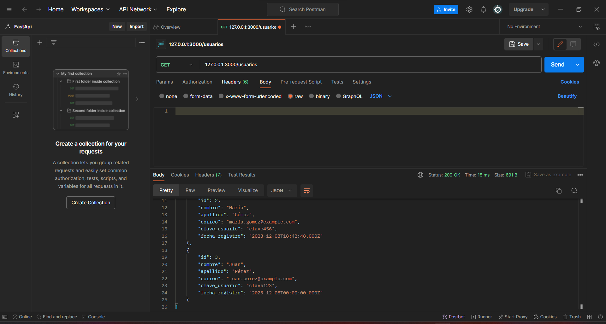

# Endpoint: `GET /usuarios`

Permite obtener información sobre los usuarios existentes en la coleccion de usuarios.

## Ejemplo de Solicitud
```http
GET /usuarios
```

## Respuesta Exitosa (Código 200 OK)
```json
{
    "id": 1,
    "nombre": "Atonio",
    "apellido": "Pérez",
    "correo": "juan.perez@example.com",
    "clave_usuario": "clave123",
    "fecha_registro": "2023-12-08T00:00:00.000Z"
},
{
    "id": 2,
    "nombre": "María",
    "apellido": "Gómez",
    "correo": "maria.gomez@example.com",
    "clave_usuario": "clave456",
    "fecha_registro": "2023-12-08T18:42:48.000Z"
}
```

## Respuestas de Errores Posibles
- Código 404 Not Found:

  ```json
  {
    "errno": 404,
    "error": "not_found",
  }
  ```

- Código 500 Internal Server Error:
  ```json
  {
    "errno": 500,
    "error": "internal_error",
    "error_description": "Ocurrió un problema para procesar la solicitud"
  }
  ```

## Imagen de la respuesta en postman



## Notas Adicionales

- Recuerda se debe colocar correctamente la ruta para obtener la información de los usuarios.
- Para consultar un usuario de manera especifica puedes ingresar a [`/usuarios/{id}`](./get-temas-id-libros.md).
